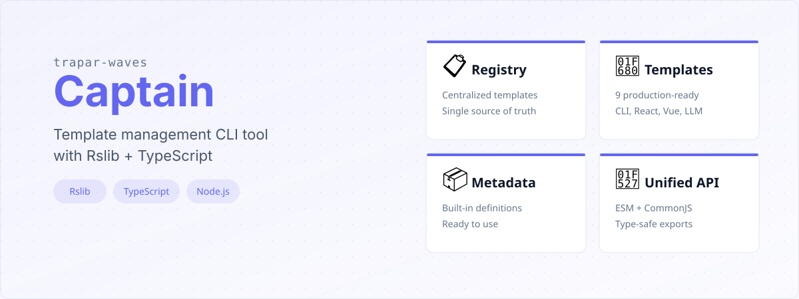
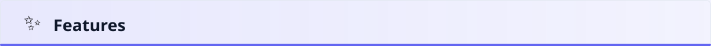
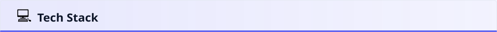
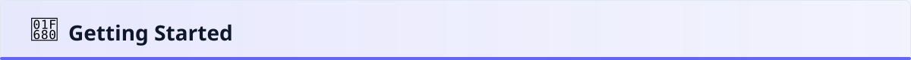
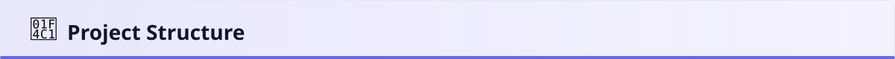
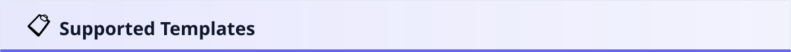
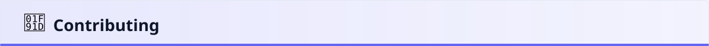
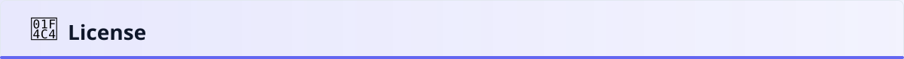

# @trapar-waves/captain


---

[English](../README.md) | [中文](./README-CN.md) | [日本語](./README-JP.md)

> Инструмент управления шаблонами для организации и перечисления различных проектных шаблонов. Предоставляет единый реестр шаблонных пакетов Trapar Waves с метаданными, обеспечивая быстрый поиск и выбор шаблонов для CLI, React, Vue, LLM и других.





- **Централизованный реестр шаблонов:** Управление несколькими проектными шаблонами (CLI, React, Vue, LLM и др.) из единого источника.
- **Предустановленные метаданные:** Поставляется со встроенными метаданными шаблонов из официальных пакетов Trapar Waves, готовыми к использованию.
- **Единый список шаблонов:** Предоставляет единообразный API (`createList`) для программного доступа и выбора шаблонов.
- **Поддержка двух форматов модулей:** Поддерживает как ESM, так и CommonJS форматы модулей для максимальной совместимости.
- **Типобезопасность:** Написан на TypeScript с экспортируемыми полными определениями типов для надёжного опыта разработки.
- **Лёгкость:** Минимальные зависимости (`destr`, `pkg-types`, `ufo`) с небольшим размером.



- **Язык:** TypeScript
- **Инструмент сборки:** Rslib (`@rslib/core`)
- **Среда выполнения:** Node.js
- **Зависимости:** `destr` (безопасный парсинг JSON), `pkg-types` (утилиты для package.json), `ufo` (утилиты для URL)
- **Линтинг:** ESLint и `@antfu/eslint-config`

Полный список зависимостей смотрите в [package.json](../package.json).



## Предварительные требования

- Node.js (рекомендуется >= 18.x)
- Менеджер пакетов (npm, yarn или pnpm)

### Установка

Установите пакет как зависимость в вашем проекте:

```bash
npm install @trapar-waves/captain
```

Или с помощью yarn:

```bash
yarn add @trapar-waves/captain
```

Или с помощью pnpm:

```bash
pnpm add @trapar-waves/captain
```

### Использование

Импортируйте и используйте список шаблонов в вашем проекте:

```ts
import { createList } from "@trapar-waves/captain";

console.log(createList);
// Выводит массив объектов шаблонов с именем и описанием
```



```
├── src/
│   ├── index.ts          # Точка входа, реэкспорт публичного API
│   ├── create-list.ts    # Логика создания списка шаблонов
│   └── package.ts        # Определения метаданных шаблонных пакетов
├── dist/                 # Скомпилированный вывод (ESM + CJS)
├── rslib.config.ts       # Конфигурация сборки Rslib
├── eslint.config.js      # Конфигурация ESLint
├── tsconfig.json         # Конфигурация TypeScript
└── package.json          # Зависимости и скрипты проекта
```



| Шаблон                                 | Описание                                              |
| -------------------------------------- | ----------------------------------------------------- |
| `@trapar-waves/cli-template`           | Шаблон разработки CLI                                 |
| `@trapar-waves/llm-template`           | Шаблон проекта LLM                                    |
| `@trapar-waves/react-antd-pro`         | Корпоративное приложение React + Ant Design Pro       |
| `@trapar-waves/react-mantine-tailwind` | React + Mantine + Tailwind UI                         |
| `@trapar-waves/react-tailwind`         | Стартер React + Tailwind                              |
| `@trapar-waves/react-tanstack`         | React + TanStack Query/Router                         |
| `@trapar-waves/react-three-maplibre`   | 3D визуализация карт (Three.js + MapLibre)            |
| `@trapar-waves/react-visgl-maplibre`   | Геопространственный 3D рендеринг (Deck.gl + MapLibre) |
| `@trapar-waves/vue-tailwind`           | Стартер Vue 3 + Tailwind                              |



Участие приветствуется и высоко ценится! Пожалуйста, следуйте этим шагам для вклада:

1. Fork репозиторий
2. Создайте ветку для новой функции (`git checkout -b feature/amazing-feature`)
3. Зафиксируйте изменения (`git commit -m 'Add some amazing feature'`)
4. Отправьте изменения в ветку (`git push origin feature/amazing-feature`)
5. Откройте Pull Request



MIT License © 2025 Trapar Waves

## 👤 Автор

- **Rikka:** [admin@rikka.cc](mailto:admin@rikka.cc)
- **Профиль GitHub:** [Muromi-Rikka](https://github.com/Muromi-Rikka)

## 🔗 Ссылки

- **Репозиторий:** [https://github.com/Trapar-waves/Captain](https://github.com/Trapar-waves/Captain)
- **Issues:** [https://github.com/Trapar-waves/Captain/issues](https://github.com/Trapar-waves/Captain/issues)
